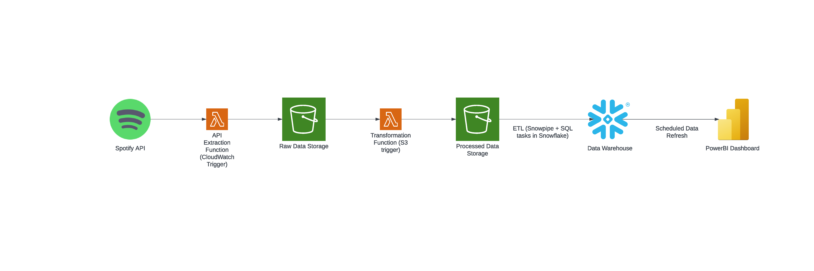
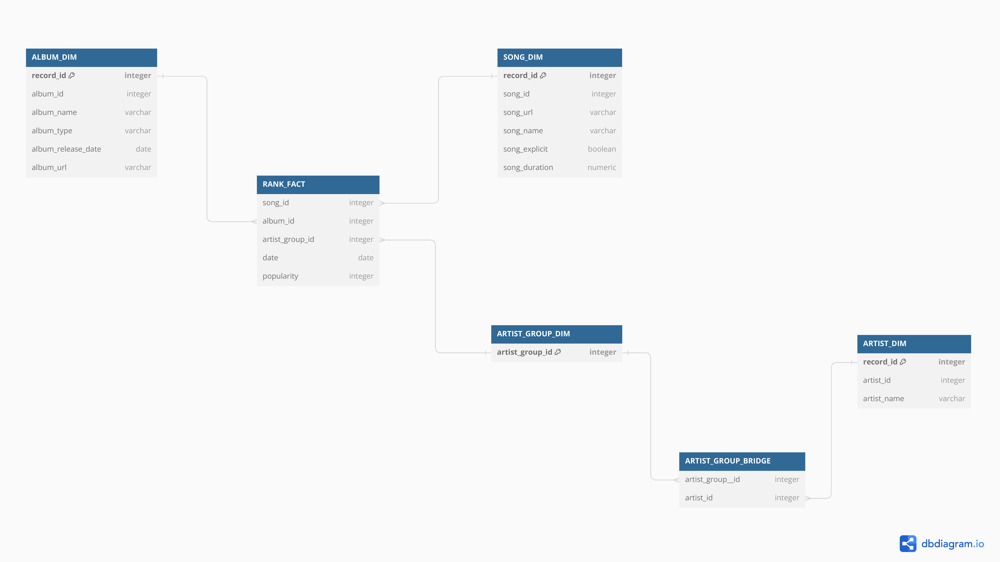

## Spotify Data Pipeline

This project was completed as a part of a Data Warehouse for Data Engineering course by Darshil Parmar and it aims to build a cloud based data pipeline. 

### Executive Summary

Spotify publishes a playlist of 50 most popular global songs, this playlist is updated daily and available at: https://open.spotify.com/playlist/37i9dQZEVXbMDoHDwVN2tF

The data pipeline contained in this repository extracts information on these songs and loads it into a data warehouse. This process occurs daily, hence the warehouse includes the ranking of songs on each day and the

corresponding information on artists and albums of the tracks. A report in PowerBI is build on top of this warehouse to visualize the data. The dashboard includes slicers so users can examine the evolution of

popularity of songs by artists/albums for example.

### Detailed Pipeline Description

The pipeline is represented by the following diagram:

Orchestration: 
    
The first lambda function is scheduled by cloudwatch to run at 3:40AM (UTC+02:00), the second is automatically triggered by an object being placed in the S3 bucket.
Snowpipes are set-up to pull data to staging tables in the snowflake dwh. The series of tasks carrying out the ETL process is scheduled to run at 3:50AM (UTC+02:00).
The automatic PowerBI refresh is scheduled to run at 4:00 AM (UTC+02:00).

Lambda Functions:

Both lambda functions are simple python scripts utilizing pandas to extract relevant information from the API response which is a JSON file. These functions are included in a separate folder in this repository.

### DWH Description

The dimensional model in the Snowflake dwh is represented by the diagram below:

The model is a classical Kimbal star schema with a transaction fact table where the grain is the placement of a given track on a given day. The album and song dimensions are self-explanatory, however the artist 

dimension is a bit more complex. There is essentially a many-to-many relationship between the songs and artists, therefore a bridge table is implemented to facilitate this relationship. 

### ETL Description

The Snowflake data warehouse in this pipeline contains a staging layer where fresh data is pulled via snowpipes. Then a series of tasks is executed where first the dimension tables are updated and then the fact 

table is loaded with new records. No CDC techniques are used in this case. The tasks are not shared in here, however they can be provided upon contacting the author of this repository.

### Dashboard Description

The final dashboard includes a graph showing the ranking of the songs filtered by artist and album. It also includes some calculated metrics of the tracks. The dashboard can be found on the following link:

https://app.fabric.microsoft.com/view?r=eyJrIjoiZDJmMzFkZjMtMGZiOS00NzM0LWI5NDctZDZmNDY5Y2FmZDA1IiwidCI6IjE0NjZjOWI5LTc3N2UtNDM5NC1hZGI5LWNhYzhhMDAzYzc4NCIsImMiOjl9
